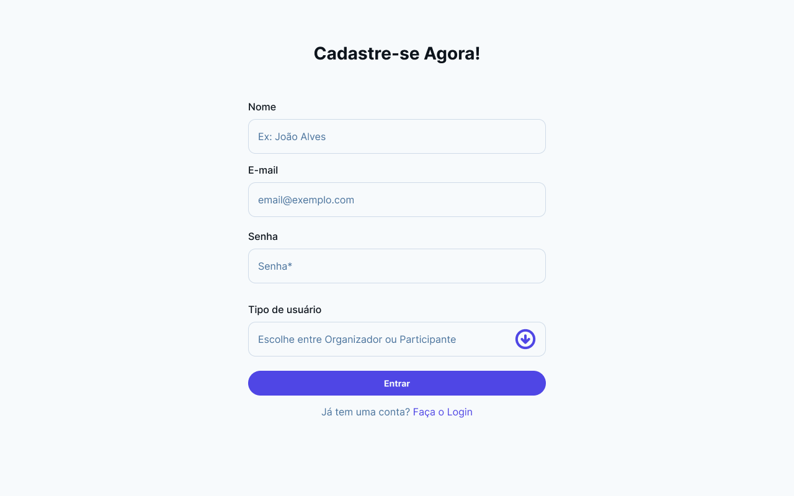

# 🟪 Simples - Plataforma de Eventos

Este repositório contém o projeto de uma **plataforma de eventos com gerenciamento de inscrições**, desenvolvido durante o Módulo 2 do 1° ano de Inteli.

O sistema permite cadastrar eventos e realizar inscrições de forma simples e eficiente, seguindo a arquitetura MVC (Model-View-Controller).

---

## 🚀 Tecnologias Utilizadas

### Backend

- **Node.js** - Runtime JavaScript
- **Express.js** - Framework web
- **PostgreSQL** - Banco de dados relacional
- **EJS** - Template engine
- **Express Session** - Gerenciamento de sessões

### Frontend

- **HTML5** - Estrutura das páginas
- **CSS3** - Estilização customizada
- **JavaScript Vanilla** - Interatividade
- **Google Fonts** - Tipografia (Inter, Plus Jakarta Sans)

---

## 📁 Estrutura de Pastas

```
projeto-eventos/
│
├── assets/            # Arquivos estáticos (imagens, diagramas)
├── config/            # Configurações do projeto e do banco de dados
├── controllers/       # Controladores da aplicação (MVC)
├── documentos/        # Documentação do projeto
│   ├── wad.md         # Web Application Document
│   └── endpoints.md   # Documentação da API
├── migrations/        # Arquivos de migração do banco
├── models/            # Modelos do banco de dados (MVC)
├── routes/            # Rotas da aplicação
├── scripts/           # Scripts úteis e inicialização
├── seeds/             # Dados iniciais para o banco
└── views/             # Templates e arquivos frontend (MVC)
    ├── pages/         # Páginas EJS da aplicação
    ├── components/    # Componentes reutilizáveis
    ├── style.css      # Estilos centralizados
    └── scripts.js     # JavaScript global
```

---

## ⚙️ Como Executar o Projeto

### Pré-requisitos

- **Node.js** (versão 14 ou superior)
- **PostgreSQL** (versão 12 ou superior)
- **NPM** ou **Yarn**

### 1. Clone o repositório

```bash
git clone https://github.com/leeunam/Projeto_Individual_Modulo02
cd Projeto_Individual_Modulo02
```

### 2. Instale as dependências

```bash
npm install
```

### 3. Configure as variáveis de ambiente

```bash
cp .env.example .env
```

Edite o arquivo `.env` com suas configurações:

```env
# Configurações do Banco de Dados
DB_USER=seu_usuario_postgres
DB_HOST=localhost
DB_DATABASE=nome_do_banco
DB_PASSWORD=sua_senha
DB_PORT=5432
DB_SSL=false

# Configurações do Servidor
PORT=3000
NODE_ENV=development

# Configurações de Sessão
SESSION_SECRET=sua_chave_secreta_super_segura_aqui
```

### 4. Inicialize o banco de dados

```bash
# Comando único para configurar tudo
npm run init-db

npm make-dev       # Popula com dados iniciais
```

### 5. Inicie o servidor

```bash
# Desenvolvimento (com nodemon)
npm run dev

# Produção
npm start
```

### 6. Acesse a aplicação

Abra seu navegador e acesse: [http://localhost:3000](http://localhost:3000)

---

## Documentação
- **[Web Application Document (WAD)](./documentos/wad.md)** - Documentação técnica completa

### Principais Funcionalidades

#### Sistema de Usuários

- Cadastro e autenticação de usuários
- Perfis: Organizador e Participante
- Sessões seguras com Express Session

#### Gestão de Eventos

- Criação e edição de eventos
- Upload de imagens
- Validação de formulários
- Sistema de inscrições

#### Gerenciamento de Endereços

- Cadastro de locais para eventos
- Validação de CEP e dados de endereço

#### Interface Responsiva

- Design moderno e intuitivo
- Componentes reutilizáveis
- Headers dinâmicos baseados no contexto
- Validações client-side

---

## Banco de Dados

### Estrutura das Tabelas

**Usuários (`users`)**

- `id`, `name`, `email`, `password`, `role`

**Endereços (`address`)**

- `id`, `street`, `number`, `district`, `cep`

**Eventos (`events`)**

- `id`, `name`, `user_id`, `address_id`, `event_time`, `event_date`, `description`

## API Endpoints

### Autenticação

- `POST /login` - Login de usuário
- `POST /register` - Cadastro de usuário

### Eventos

- `GET /eventos` - Lista eventos
- `POST /criarEvento` - Cria evento
- `GET /evento/:id/editar` - Editar evento
- `POST /evento/:id/inscrever` - Inscrever em evento

### API REST

- `GET /api/events` - Lista eventos (JSON)
- `POST /api/events` - Cria evento (JSON)
- `PUT /api/events/:id` - Atualiza evento (JSON)
- `DELETE /api/events/:id` - Remove evento (JSON)

**📋 Documentação completa:** [endpoints.md](./documentos/endpoints.md)

---

## Vídeo de Demonstração
**[Assista ao vídeo de demonstração completa do sistema](https://www.youtube.com/watch?v=UCycreyr9es&feature=youtu.be)**

*O vídeo mostra todas as funcionalidades principais: cadastro, login, criação de eventos, inscrições e gerenciamento.*

---

## Screenshots

### Página Inicial


### Sistema de Autenticação




### Gestão de Eventos


---

## Resolução de Problemas

### Erro de Conexão com PostgreSQL

```bash
# Verifique se o PostgreSQL está rodando
sudo systemctl status postgresql

# Verifique as credenciais no arquivo .env
# Certifique-se de que o banco de dados existe
```

### Erro de Migrations

```bash
# Reset completo do banco
npm run db:reset
```

### Porta já em uso

```bash
# Altere a PORT no arquivo .env
# Ou finalize o processo na porta 3000
lsof -ti:3000 | xargs kill -9
```
---

## Desenvolvimento

### Estrutura MVC

- **Model** (`models/`): Lógica de negócios e acesso a dados
- **View** (`views/`): Interface do usuário (EJS + CSS + JS)
- **Controller** (`controllers/`): Lógica de aplicação e rotas

---

## 🧑‍💻 Autor

Desenvolvido por Leunam Sousa de Jesus

[LinkedIn](https://www.linkedin.com/in/leunam/)

## 📝 Licença

Simples by Inteli, Leunam Sousa de Jesus is licensed under Creative Commons Attribution 4.0 International
