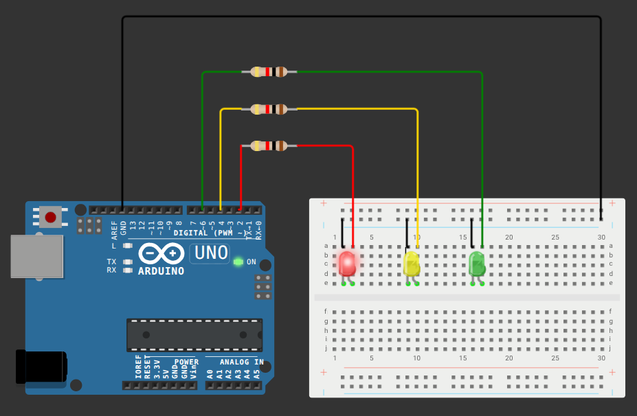

# Semáforo usando Arduino UNO

O seguinte projeto tem como intuito simular o funcionamento de um semáforo utilizando de arduino UNO.

Caso deseje replicar a aplicação basta utilizar dos seguintes componentes:

| Quantidade | Componentes | Especificações                         |
| ---------- | ----------- | -------------------------------------- |
| 1          | Arduino UNO | Microcontrolador                       |
| 4          | Jumper      | Conexão de circuito                    |
| 3          | Resistor    | Controle de carga                      |
| 3          | LED         | Atuador que emiti luz ao receber carga |

Para que a montagem seja feita de maneira correta, é recomendável seguir a seguinte montagem:

> O código para implementação consegue ser acessado [aqui](códigoc++.cpp)

---

**OBS:** Caso deseje ver a implementação física o arquivo é AtvAula03/arduino-de-perto-mp4 ou [clique aqui](arduino-de-perto.mp4)